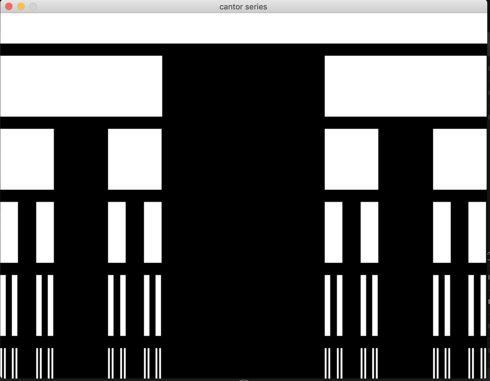

# cantor_set
[Cantor set](https://en.wikipedia.org/wiki/Cantor_set) in [Funk](https://github.com/diegovalverde/funk)!

<p style="text-align:center;"></p>

## To build:

Make sure you get the Funk toolchain from [here](https://github.com/diegovalverde/funk).

```python <path_to_your_funk>/funky.py cantor_set.f --include <path_to_your_funk>/include```

Also, you may need to install [simple 2d library](https://github.com/simple2d/simple2d)


